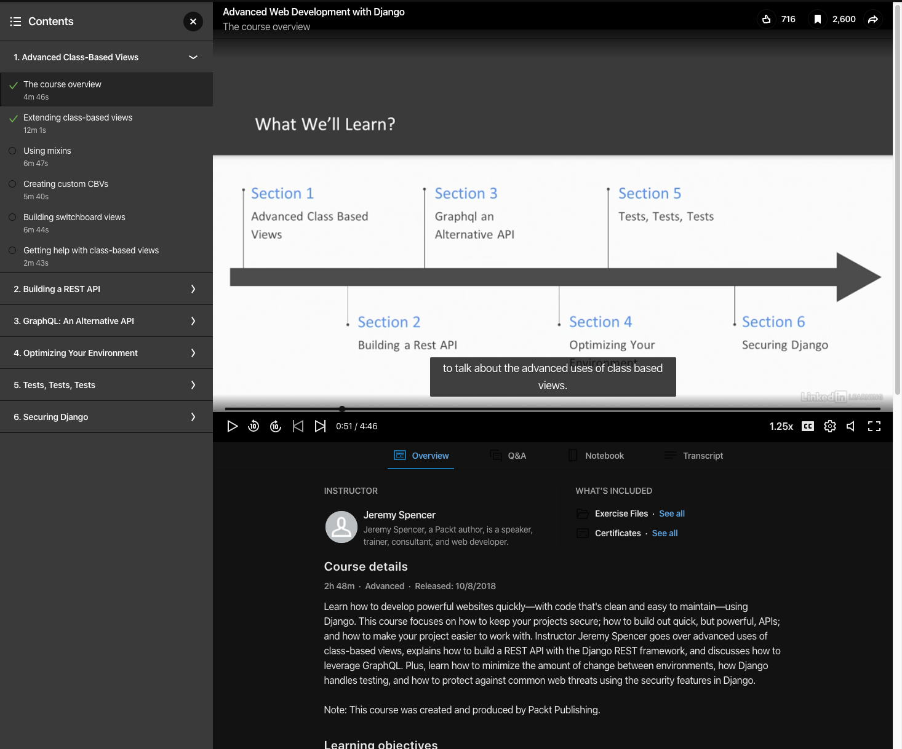

# 1\. create and activate \(env_pizza\)

```
create github repo titled => studioScheduler
```

`git clone git@github.com:DevLuDaley/django-forms.git`

`cd studioscheduler`

`python3 -m venv env_studioscheduler`

<br>
\`\`\`
actovate environment - also either vcode will ask or just press  \`shift +cmd +P\` and select interpreter
\`\`\`

`source env_studioscheduler/bin/activate`

```
access command palette => [cmd + shift + P]
enter 'interpreter'
select python env
```

<br>
<br>
```
select ['env_studioscheduler':venv] environment
```

# 2\. setup env complete django

# 3\. git checkout 2-setup-django

clone setup env branch to create 'stup-django' branch

git checkoiut to new branch

`git checkout setup_django`

```
note:
  if you get an error pull the latest version of the master project from the remote repo.
  Now the local git knows about the new branch ('django-setup') created in remote git/GitHub
```

`git pull`

# 4\. install django + project & app

`pip install django`

```
create studio project & folder
```

`django-admin startproject studio`

```
rename project folder to projectstudio
```

`mv studio/ projectstudio`

- the tutorial says nandiasgarden-project but "name-project" produces an error in py 3.8\*\*
- rename project folder. add project to start of the name i.e folder => projectfolder or projectnandiasgarden for this project
- this helps differentiate between the project folder and the autogenerate folder (with the identaical project name) that lives in the project folder

```
open projectstudio
```

`cd projectstudio`

```
create scheduler app
```

`django-admin startapp scheduler`

update settings.py
to include new app => 'scheduler'
change Timezone to 'EST'

```
use github desktop app
commit=>push => create new_branch (clone current) => checkout new_branch
```

# 5\. git checkout 3-setup-models/relationships

# 6\. create models

# 7. prepare to convert to class based views

also installed bandit for python linting

created defualts for models to ensure that their fields coule be persisted to the db.


good video for class based views => https://www.linkedin.com/learning/advanced-web-development-with-django/extending-class-based-views

uses the polls app that you built from django sit...try to branch and follow-along to learn about class based views. if not then select a diff tutorial either from youtubve or django docs site.

https://www.youtube.com/watch?v=-tqhhT3R6VY



pip install coverage made me remove widget_thingy from settings.py and createsession form.

```yml

practice-python/StudioScheduler/projectstudio  4-setup-model-indices ✗ ruby-2.6.2h20m ⚑
▶ pip install coverage
Collecting coverage
  Downloading https://files.pythonhosted.org/packages/a1/b4/ae4cacbae2c1ad8179c589847e03c762abd65b905d13ae9413f749a71591/coverage-5.0.3-cp38-cp38-macosx_10_13_x86_64.whl (203kB)
     |█▋                              | 10kB      |███▎                            | 20kB      |████▉                           | 30kB      |██████▌                         | 40kB      |████████                        | 51kB      |█████████▊                      | 61kB      |███████████▎                    | 71kB      |█████████████                   | 81kB      |██████████████▌                 | 92kB      |████████████████▏               | 102kB     |█████████████████▊              | 112kB     |███████████████████▍            | 122kB     |█████████████████████           | 133kB     |██████████████████████▋         | 143kB     |████████████████████████▏       | 153kB     |█████████████████████████▉      | 163kB     |███████████████████████████▍    | 174kB     |█████████████████████████████   | 184kB     |██████████████████████████████▋ | 194kB     |████████████████████████████████| 204kB 4.4MB/s
Installing collected packages: coverage
Successfully installed coverage-5.0.3
WARNING: You are using pip version 19.2.3, however version 20.0.2 is available.
You should consider upgrading via the 'pip install --upgrade pip' command.
(env_studioscheduler)
practice-python/StudioScheduler/projectstudio  4-setup-model-indices ✗ ruby-2.2h20m ⚑ ◒
▶ coverage run --source='.' manage.py test
Traceback (most recent call last):
  File "manage.py", line 21, in <module>
    main()
  File "manage.py", line 17, in main
    execute_from_command_line(sys.argv)
  File "/usr/local/lib/python3.7/site-packages/django/core/management/__init__.py", line 401, in execute_from_command_line
    utility.execute()
  File "/usr/local/lib/python3.7/site-packages/django/core/management/__init__.py", line 377, in execute
    django.setup()
  File "/usr/local/lib/python3.7/site-packages/django/__init__.py", line 24, in setup
    apps.populate(settings.INSTALLED_APPS)
  File "/usr/local/lib/python3.7/site-packages/django/apps/registry.py", line 91, in populate
    app_config = AppConfig.create(entry)
  File "/usr/local/lib/python3.7/site-packages/django/apps/config.py", line 90, in create
    module = import_module(entry)
  File "/usr/local/Cellar/python/3.7.6_1/Frameworks/Python.framework/Versions/3.7/lib/python3.7/importlib/__init__.py", line 127, in import_module
    return _bootstrap._gcd_import(name[level:], package, level)
  File "<frozen importlib._bootstrap>", line 1006, in _gcd_import
  File "<frozen importlib._bootstrap>", line 983, in _find_and_load
  File "<frozen importlib._bootstrap>", line 965, in _find_and_load_unlocked
ModuleNotFoundError: No module named 'widget_tweaks'
(env_studioscheduler)
practice-python/StudioScheduler/projectstudio
  4-setup-model-indices ✗ ruby-22h21m ⚑ ◒  ⍉
▶ ls
db.sqlite3  manage.py  scheduler  studio
(env_studioscheduler)
practice-python/StudioScheduler/projectstudio  4-setup-model-indices ✗ ruby-2.2h21m ⚑ ◒
▶ coverage run --source='.' python3 manage.py test
No file to run: 'python3'
(env_studioscheduler)
practice-python/StudioScheduler/projectstudio  4-setup-model-indices ✗ ruby-22h21m ⚑ ◒  ⍉
▶ pip install widget_tweaks                  Collecting widget_tweaks
  ERROR: Could not find a version that satisfies the requirement widget_tweaks (from versions: none)
ERROR: No matching distribution found for widget_tweaks
WARNING: You are using pip version 19.2.3, however version 20.0.2 is available.
You should consider upgrading via the 'pip install --upgrade pip' command.
(env_studioscheduler)
practice-python/StudioScheduler/projectstudio  4-setup-model-indices ✗ ruby-22h23m ⚑ ◒  ⍉
▶ pip install django-widget-tweaks
Requirement already satisfied: django-widget-tweaks in /Users/LHD/Development/code/practice/practice-python/StudioScheduler/env_studioscheduler/lib/python3.8/site-packages (1.4.5)
WARNING: You are using pip version 19.2.3, however version 20.0.2 is available.
You should consider upgrading via the 'pip install --upgrade pip' command.
(env_studioscheduler)
practice-python/StudioScheduler/projectstudio  4-setup-model-indices ✗ ruby-2.2h24m ⚑ ◒
▶ coverage run --source='.' python3 manage.py test
No file to run: 'python3'
(env_studioscheduler)
practice-python/StudioScheduler/projectstudio  4-setup-model-indices ✗ ruby-22h24m ⚑ ◒  ⍉
▶ coverage run --source='.' manage.py test   Traceback (most recent call last):
  File "manage.py", line 21, in <module>
    main()
  File "manage.py", line 17, in main
    execute_from_command_line(sys.argv)
  File "/usr/local/lib/python3.7/site-packages/django/core/management/__init__.py", line 401, in execute_from_command_line
    utility.execute()
  File "/usr/local/lib/python3.7/site-packages/django/core/management/__init__.py", line 377, in execute
    django.setup()
  File "/usr/local/lib/python3.7/site-packages/django/__init__.py", line 24, in setup
    apps.populate(settings.INSTALLED_APPS)
  File "/usr/local/lib/python3.7/site-packages/django/apps/registry.py", line 91, in populate
    app_config = AppConfig.create(entry)
  File "/usr/local/lib/python3.7/site-packages/django/apps/config.py", line 90, in create
    module = import_module(entry)
  File "/usr/local/Cellar/python/3.7.6_1/Frameworks/Python.framework/Versions/3.7/lib/python3.7/importlib/__init__.py", line 127, in import_module
    return _bootstrap._gcd_import(name[level:], package, level)
  File "<frozen importlib._bootstrap>", line 1006, in _gcd_import
  File "<frozen importlib._bootstrap>", line 983, in _find_and_load
  File "<frozen importlib._bootstrap>", line 965, in _find_and_load_unlocked
ModuleNotFoundError: No module named 'widget_tweaks'
(env_studioscheduler)
practice-python/StudioScheduler/p
(env_studioscheduler)
practice-python/StudioScheduler/p
rojectstudio  4-setup-model-indic
es ✗ ruby-2.6.1     2h25m ⚑ ◒  ⍉
▶ coverage run --source='.' manage.py test
System check identified no issues (0 silenced).

----------------------------------------------------------------------
Ran 0 tests in 0.000s

OK
(env_studioscheduler)
practice-python/StudioScheduler/projectstudio  4-setup-model-indices ✗ ruby-2.6.1      2h28m ⚑ ◒
▶ coverage html
(env_studioscheduler)
practice-python/StudioScheduler/projectstudio  4-setup-model-indices ✗ ruby-2.6.1      2h28m ⚑ ◒
▶ coverage report
Name                                               Stmts   Miss  Cover
----------------------------------------------------------------------
manage.py                                             12      2    83%
scheduler/__init__.py                                  0      0   100%
scheduler/admin.py                                     6      0   100%
scheduler/apps.py                                      3      3     0%
scheduler/forms.py                                     7      0   100%
scheduler/migrations/0001_initial.py                   5      5     0%
scheduler/migrations/0002_artist_location.py           4      4     0%
scheduler/migrations/0003_auto_20200227_2000.py        5      5     0%
scheduler/migrations/0004_remove_session_name.py       4      4     0%
scheduler/migrations/0005_auto_20200307_0508.py        5      5     0%
scheduler/migrations/__init__.py                       0      0   100%
scheduler/models.py                                   27      4    85%
scheduler/tests.py                                     1      0   100%
scheduler/views.py                                    32     22    31%
studio/__init__.py                                     0      0   100%
studio/settings.py                                    18      0   100%
studio/urls.py                                         6      0   100%
studio/wsgi.py                                         4      4     0%
----------------------------------------------------------------------
TOTAL                                                139     58    58%
(env_studioscheduler)
practice-python/StudioScheduler/projectstudio  4-se
(env_studioscheduler)
(env_studioscheduler)
practice-python/StudioScheduler/projectstudio  4-se
tup-model-indices ✗ ruby-2.6.1         2h43m ⚑ ◒
▶


```

<!-- ! -->

restart on Wednesday March 18th

<!-- ! -->

update current project
need :
add js/react
add pagination
add tests
add data (autofeed, humanize?)

```
npm install --save react-router-dom

```
